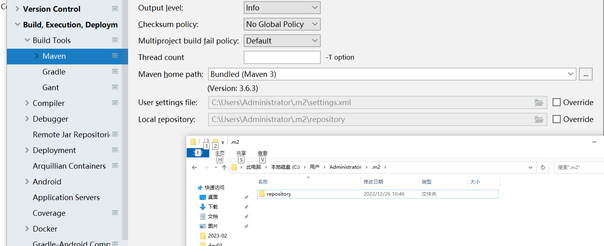

### HAVING

- WHERE关键字后面只能写普通字段条件,不能写包含聚合函数的条件
- HAVING专门用来添加包含聚合函数条件的关键字, 需要和分组查询结合使用

1. 查询每个部门的平均工资,要求平均工资大于2000   

​	SELECT dept_id,AVG(sal) FROM emp  GROUP BY dept_id HAVING AVG(sal)>2000;

2. 查询每种工作的人数,只查询人数大于 1 的

   SELECT job,COUNT(*) c FROM emp GROUP BY job HAVING c>1;

3. 查询每个部门的工资总和,只查询有领导的员工, 并且要求工资总和大于 5400.

   SELECT dept_id,SUM(sal) s FROM emp WHERE manager IS NOT NULL GROUP BY dept_id HAVING s>5400;

4. 查询每个部门的平均工资, 只查询工资在 1000 到 3000 之间的,并且过滤掉平均工资低于 2000 的

   SELECT dept_id,AVG(sal) a FROM emp 

   WHERE sal BETWEEN 1000 AND 3000 

   GROUP BY dept_id HAVING a>=2000 ;

### 子查询(嵌套查询)

1. 查询工资高于2号部门平均工资的员工信息

​	SELECT * FROM emp WHERE sal>(SELECT AVG(sal) FROM emp WHERE dept_id=2);

 2. 查询工资高于程序员最高工资的员工信息

    SELECT * FROM emp WHERE sal>(SELECT MAX(sal) FROM emp WHERE job='程序员');

 3. 查询工资最高的员工信息

    SELECT * FROM emp WHERE sal=(SELECT MAX(sal) FROM emp);

 4. 查询和孙悟空相同工作的员工信息

    SELECT * FROM emp WHERE job=(SELECT job FROM emp WHERE name='孙悟空') AND name!='孙悟空';

 5. 查询拿最低工资员工的同事们的信息 (同事指同一部门)

    SELECT MIN(sal) FROM emp;

    SELECT dept_id FROM emp WHERE sal=(SELECT MIN(sal) FROM emp);

    

    SELECT * FROM emp WHERE dept_id=(SELECT dept_id FROM emp WHERE sal=(SELECT MIN(sal) FROM emp)) AND sal!=(SELECT MIN(sal) FROM emp);

### 数值计算

1. 查询每个员工的姓名,工资和年终奖(5个月的工资)

​		SELECT name,sal,5*sal 年终奖 FROM emp;

2. 给每个2号部门的员工涨薪5块钱   

   UPDATE emp SET sal=sal+5 WHERE dept_id=2;

### 关联关系

- 创建表时表和表之间存在的业务关系
- 存在哪几种关系? 
  - 一对一:  有AB两张表,A表中的一条数据对应B表中的一条数据, 同时B表中的一条数据也对应A表中的一条数据
  - 一对多:  有AB两张表,A表中的一条数据对应B表中的多条数据, 同时B表中的一条数据对应A表中的一条数据
  - 多对多:有AB两张表,A表中的一条数据对应B表中的多条数据, 同时B表中的一条数据也对应A表中的多条数据
- 如何建立关系:
  - 一对一:     在任何一张表中添加一个建立关系的字段指向另外一张表的主键.
  - 一对多:    在多的表里面添加建立关系的字段指向另外一张表的主键
  - 多对多:    需要添加一个关系表,表中至少有两个字段分别指向另外两张表的主键

### 关联查询

- 查询存在关联关系的多张表的数据时,使用的查询方式称为关联查询
- 关联查询包括: 等值连接, 内连接和外连接 三种方式
- 关联查询必须写关联关系,如果不写会得到两个表数据的乘积, 这个乘积称为笛卡尔积.由于工作中表里面的数据量巨大,所以切记不要出现此情况

### 等值连接

- 格式:   SELECT * FROM A,B  WHERE 关联关系 AND 其它条件

1.  查询1号部门每个员工的姓名和对应的部门名以及部门地点

```mysql
SELECT  e.name,d.name,loc
FROM emp e,dept d 
WHERE e.dept_id=d.id AND d.id=1;
```

2. 查询工资高于2000的员工姓名,工资和部门名称

   SELECT  e.name,sal,d.name 
   FROM emp e,dept d 
   WHERE e.dept_id=d.id AND sal>2000;

3. 查询孙悟空的部门地址

```
SELECT loc
FROM emp e,dept d
WHERE e.dept_id=d.id AND e.name='孙悟空';
```

### 内连接

- 等值连接和内连接查询到的数据是一样的, 推荐使用内连接

- 格式:   SELECT * FROM A JOIN B ON 关联关系 WHERE 其它条件;

1. 查询1号部门每个员工的姓名和对应的部门名以及部门地点

   SELECT e.name,d.name,loc

   FROM emp e JOIN dept d ON e.dept_id=d.id

   WHERE e.dept_id=1;

2. 查询工资高于2000的员工姓名,工资和部门名称

   SELECT e.name,sal,d.name

   FROM emp e JOIN dept d ON e.dept_id=d.id

   WHERE sal>2000;

3. 查询孙悟空的部门地址

   SELECT loc

   FROM emp e JOIN dept d ON e.dept_id=d.id

   WHERE e.name='孙悟空';

### 外连接

- 等值连接和内连接查询的是两个表的交集数据, 外连接可以查询到一张表的全部数据以及另外一张表的交集数据
- 格式: SELECT * FROM A LEFT/RIGHT JOIN B ON 关联关系 WHERE 其它条件;

 1. 查询所有员工姓名和对应的部门名

    INSERT INTO emp(name,sal) VALUES('灭霸',5);

    SELECT e.name,d.name

    FROM emp e LEFT JOIN dept d ON e.dept_id=d.id;

 2. 查询所有部门的工作地点,和对应的员工姓名,工作

    SELECT loc,e.name,job

    FROM emp e RIGHT JOIN dept d ON e.dept_id=d.id;


### 综合练习题

1. 查询工资高于程序员平均工资的员工信息

   SELECT * FROM emp WHERE sal>(SELECT AVG(sal) FROM emp WHERE job='程序员');

2. 查询工作人数为1的 工作名称

   SELECT JOB,COUNT(*) c FROM emp GROUP BY job HAVING c=1;

3. 查询1号和2号部门中工资大于2000的员工姓名和部门名

   SELECT e.name,d.name

   FROM emp e JOIN dept d ON e.dept_id=d.id

   WHERE e.dept_id IN(1,2) AND sal>2000;

4. 查询所有员工的名称,工资和对应的部门信息

   SELECT e.name,sal,d.*

   FROM emp e LEFT JOIN dept d ON e.dept_id=d.id;

5. 查询员工人数为2的工作名称

   SELECT job FROM emp WHERE job IS NOT NULL GROUP BY job HAVING COUNT(*)=2;

6. 查询最高工资员工的部门名

   SELECT name FROM dept 

   WHERE id=(SELECT dept_id FROM emp WHERE sal=(SELECT MAX(sal) FROM emp));

### JDBC 

- Java DataBase Connectivity : Java数据库连接 

- JDBC是Sun公司提供的一套用于Java语言和数据库进行连接的API(Application Programma Interface应用程序编程接口)  

  

- 为什么提供JDBC接口?

  Sun公司为了避免Java程序员每一种数据库软件都学习一套全新的方法,  通过JDBC接口将方法名定义好,让各个数据库厂商根据此接口中的方法名写各自的实现类(驱动), 这样Java程序员只需要学习JDBC接口中方法的调用,就可以访问任何数据库软件,甚至更换数据库时代码都不需要改变只需要换一个jar包即可,这样大大降低了Java程序员的学习成本.

- 如何使用JDBC连接MySQL数据库

  - 创建maven工程

  - 在工程的pom.xml里面添加以下内容,引入MySQL相关的jar包

    ```xml
    <dependencies>
        <!-- 连接MySQL数据库的依赖 -->
        <dependency>
            <groupId>mysql</groupId>
            <artifactId>mysql-connector-java</artifactId>
            <version>8.0.15</version>
        </dependency>
    </dependencies>
    ```

    - 在java文件夹下创建cn.tedu.Demo01.java文件, 在main方法中添加以下代码:

    ```java
    //1. 获取数据库连接对象 导包java.sql    抛出异常
    Connection conn =
            DriverManager.getConnection("jdbc:mysql://localhost:3306/empdb?characterEncoding=utf8&serverTimezone=Asia/Shanghai&useSSL=false",
                    "root","root");
    System.out.println(conn);
    //2. 获取执行SQL语句的对象
    Statement s = conn.createStatement();
    //3. 执行SQL语句
    String sql = "CREATE TABLE jdbct1(name VARCHAR(10),age INT)";
    s.execute(sql); //execute=执行
    System.out.println("执行完成!");
    //4.关闭资源
    conn.close();
    ```

### Statement

- 用于执行SQL语句
- execute(sql);    此方法可以执行任意SQL语句,但是推荐执行DDL数据定义语言
- int row = executeUpdate(sql);  此方法执行增删改相关的SQL语句,方法的返回值表示生效的行数
- ResultSet rs = executeQuery(sql);  此方法执行查询相关的SQL语句, ResultSet对象用来封装查询回来的结果.

### DBCP

- DataBase Connection Pool 数据库连接池

- 作用: 使用数据库连接池可以将连接重用, 避免频繁开关连接造成的资源浪费,从而提高执行效率

  

- 如何使用数据库连接池

  - 在pom.xml里面添加数据库连接池的依赖

  - 通过以下代码使用连接池:

    ```java
    //创建数据库连接池对象
    DruidDataSource dds = new DruidDataSource();
    //设置连接数据库的信息
    dds.setUrl("jdbc:mysql://localhost:3306/empdb?characterEncoding=utf8&serverTimezone=Asia/Shanghai&useSSL=false");
    dds.setUsername("root");
    dds.setPassword("root");
    //设置初始连接数量
    dds.setInitialSize(3);
    //设置最大连接数量
    dds.setMaxActive(5);
    //从连接池中获取连接对象    异常抛出
    Connection conn = dds.getConnection();
    System.out.println(conn);
    ```

### 综合练习

1. 创建Demo06 在main里面创建一个hero表 有id,name,age字段
2. 创建Demo07在main里面往英雄表中添加    孙悟空,500岁      猪八戒,300岁
3. 创建Demo08在main里面删除猪八戒
4. 创建Demo09在main里面修改孙悟空为齐天大圣
5. 创建Demo10 在里面查询hero表 并在控制台输出name和age


### 练习:

1. 创建maven工程jdbc02, 在pom.xml中添加两个依赖(刷新maven)
2. 创建cn.tedu包 , 把jdbc01工程中的DBUtils复制到包里面
3. 创建Demo01 在main里面创建一个car表 有id,title,type类型,price字段
4. 创建Demo02在main里面往英雄表中添加 3辆车的信息到表中
5. 创建Demo03在main里面删除最后一条
6. 创建Demo04在main里面修改其中一辆车的信息为 奔驰S500 类型为轿车 价格9.9
7. 创建Demo05 在里面查询car表 并在控制台输出所有信息


### 配置Maven

- 检查Maven的配置文件是否存在, 查看idea 的settings里面,找到settings.xml配置文件的位置, 然后查看此位置是否存在settings.xml文件,  下图就是不存在

  

- 从doc.canglaoshi.org网站中下载配置文件, 下载完之后 把里面的settings.xml解压出来,保存到上面的.m2文件夹下


